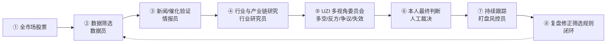

# A股投研统一执行框架 · Unified A-share Research Workflow

一个面向 [WorkBuddy](https://www.workbuddy.cn) 的投研 Skill：把"分析一只股票 / 一个板块 / 做一次行情研究"固定成一条**可复用、可复核、带风控闭环**的 8 阶段流水线。

🌐 在线预览（GitHub Pages）：https://ChadXie.github.io/a-share-research-framework/

> 适用场景：A股 / 港股 / ETF 的个股与板块研究。本框架的价值不在于"给一个结论"，而在于把研究过程**标准化**——每一阶段都产出结构化证据，串到下一阶段，并最终汇聚成一份**自包含的 HTML 可视化投研报告**（默认交付物）。

> 📌 **关于产出形态**：本框架运行一次分析后，默认产出的是一份 **HTML 可视化报告**（`examples/投研可视化报告_模板.html` 为可复用模板），而非 Markdown 文档。本仓库根目录的 `index.html` 是框架本身的介绍页，请勿与"分析产出"混淆。

---

## 为什么需要它

零散的"帮我看看 XX 股票"往往得不到一致、可复用的产出。本框架强制：

- **角色分工**：数据员 → 情报员 → 行业研究员 → 投资委员会 → 人工裁决 → 盯盘风控员 → 复盘，每个角色对应具体 Skill。
- **多空对冲**：UZI 多视角委员会强制产出四要素（多头 / 反方 / 争议 / 失效），避免单边叙事。
- **人机协作**：WorkBuddy 负责证据链与风险收益比，最终买卖由使用者本人拍板。
- **闭环复盘**：跟踪结果回灌筛选规则，越用越准。

---

## 8 阶段流水线



每个阶段的角色、工具与产出，详见 [`SKILL.md`](./SKILL.md)。

---

## 安装

```bash
# 方式一：克隆到 WorkBuddy 技能目录
git clone https://github.com/<你的用户名>/a-share-research-framework.git \
  ~/.workbuddy/skills/a-share-research-framework

# 方式二：直接把本仓库 SKILL.md 与配套文件复制到
#   ~/.workbuddy/skills/a-share-research-framework/
```

重启 / 刷新 WorkBuddy 后，当对话中出现"分析某只股票""做行情分析""筛选候选池""多空辩论""盯盘风控""复盘规则"等意图时，框架会自动加载。

---

## 配套技能（需另行安装）

本框架是"编排层"，具体执行依赖以下 Skill（在 WorkBuddy 技能市场或对应仓库获取）：

| 阶段 | 角色 | 主用 Skill | 备选 |
|---|---|---|---|
| 1 | 数据员 | a-stock-data | a-stock-screen, alphaear-stock |
| 2 | 情报员 | alphaear-news | a-stock-data(新闻) |
| 3 | 行业研究员 | industry-chain-analysis | serenity-skill |
| 4 | 投资委员会 | UZI-Skill | — |
| 6 | 盯盘风控员 | a-share-watch-copilot | alphaear-signal-tracker |
| 7 | 复盘 | a-stock-screen / a-stock-data | 工作区记忆 |

> 若未安装某些配套 Skill，框架会在对应阶段给出"降级方案"（如直接用 Web 搜索 + 公开数据源替代），不会中断流水线。

---

## 示例

仓库 `examples/` 目录提供一套模板 + 一份完整示例（以中际旭创 300308 为例），演示框架的完整产出：

- **`投研可视化报告_模板.html`** — ⭐ 可复用的 HTML 报告模板（自带 `{{占位符}}` + 自动缩放柱状图），套任意标的：替换占位符与 `data-chart` 数值即可，无需改样式。**这是框架默认产出的母版。**
- `中际旭创_投研可视化.html` — 用模板跑出的完整示例报告（8 阶段流水线 + 财务增长图 + 催化表 + 产业链地图 + UZI 四象限 + 风控预警）
- `中际旭创_投研决策备忘录.md` — 文本版备忘录（8 阶段全产物，可选）
- `投研决策备忘录_模板.md` — 可复用的 Markdown 备忘录模板（可选）

---

## 合规与免责

- 本框架产出的是**研究观点，非投资建议**，不承诺收益、不诱导追涨。
- 涉及投资建议或对外发布内容时，请按你所在机构的合规模板附风险提示与执业标识。
- 最终买卖决策由使用者本人独立判断，风险自担。

---

## License

[MIT](./LICENSE)
